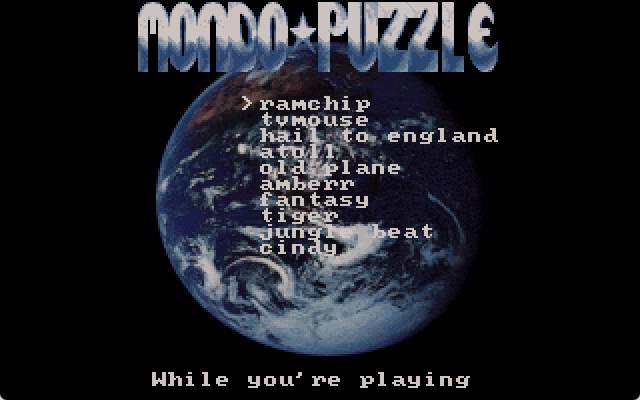

# Mondo Puzzle

Welcome to Mondo Puzzle, a sliced image puzzle game, written in Pascal.

This one was developed in 1995, in the spare time while at university. 

It was one of the first games made on my shiny new PC, a 386-DX40. Actually having a PC was a great improvement to the development process, because previous games were developed by carrying a floppy disk around and working whereever I could find a computer with Pascal installed.

Never released commercially, it was just game development practice, trying to make a polished product (although it lacks music, still pretty polished overall).

## Gameplay Instructions

Keyboard controls:
* 'T' in the main menu to switch difficulty (4x3 or 8x6 puzzles)
* arrow keys to move 
* Space/Enter to select
* ESC to quit level/game

DOS version should work with both mouse and keyboard.

## Media

## License

Code license:
https://opensource.org/licenses/MIT

## Setup&Install&Build (original)

Requirements:
* build: Turbo Pascal/Borland Pascal
* run: MS-DOS or emulation (DOSBox, FreeDOS)
